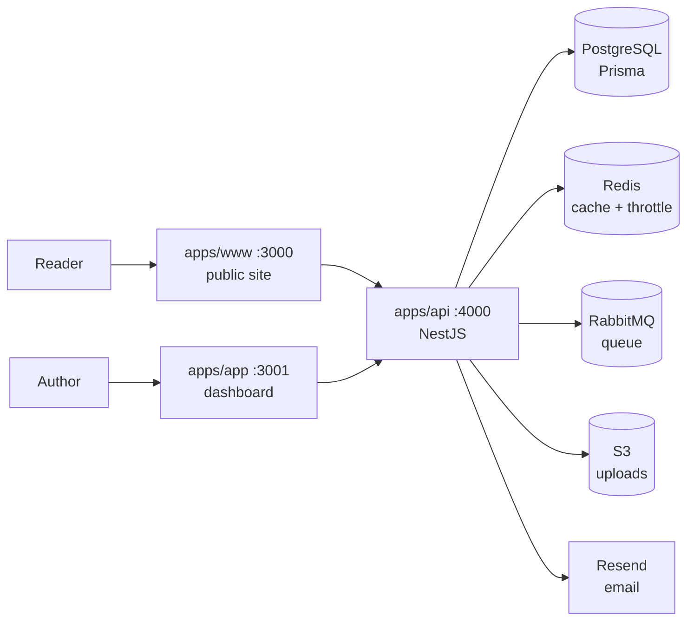

# Writora

A self-hostable blogging platform. Each author gets a themable site at `yourdomain.com/username`, a custom domain, email subscribers, and a real authoring experience — without the bloat of WordPress or the rent-seeking of Medium.

> **Status:** active development. Local dev works end-to-end. Production deploys are possible but rough edges remain (see [Known limitations](#known-limitations)).

---

## What's in the box

**For authors**

- Rich-text editor (Tiptap) with images, code blocks, embeds — drag/drop & paste images upload to object storage
- 40+ swappable themes per blog (powered by [tweakcn](https://tweakcn.com))
- Autosave + unsaved-changes guard
- Auto read-time, SEO metadata, JSON-LD article schema, dynamic OG images
- Analytics dashboard (views over time, top posts, week-over-week trend)
- Search + draft/published filters
- Subscribers with double opt-in
- **Email newsletter blast on every publish** (durable via RabbitMQ)
- Profile editor (avatar, bio, socials, custom domain)

**For readers**

- Per-author public site at `/{username}` with hero + grid + bio
- Per-post `/{username}/{slug}` with TOC, related posts, view tracking (deduped per IP)
- RSS feed at `/{username}/feed.xml` with auto-discovery
- Subscribe widget on every page

**For ops**

- Redis caching on hot read paths (60s TTL with explicit invalidation on writes)
- Redis-backed per-IP rate limiting on auth, subscribe, upload endpoints
- RabbitMQ durable queue for newsletter blasts
- S3-compatible object storage (AWS S3, Cloudflare R2, B2, Spaces, MinIO — one env-var switch)
- Sitemap + robots.txt
- Image optimization via sharp (max 2000px, WebP, EXIF rotation honored)
- Graceful degradation: Redis/Rabbit/S3 unset → fall back to no-op / inline / disk

---

## Architecture



Three apps share a single API. Auth is JWT in an httpOnly cookie shared across the `.yourdomain.com` subdomain.

---

## Quick start (Docker)

```bash
# 1. Spin up the full stack (the api applies migrations on startup)
docker compose up -d --build

# 2. Open
open http://localhost:3000   # public site (www)
open http://localhost:3001   # dashboard (app)
```

The compose file includes Postgres, Redis, RabbitMQ, and the three apps. RabbitMQ management UI is at <http://localhost:15672> (`guest`/`guest`).

To override env vars, create `.env` at the repo root or export them in your shell — compose interpolates them. See `apps/api/.env.example` for the full list.

---

## Local dev (without Docker)

You'll need: Node 22, pnpm 10, Postgres, optionally Redis + RabbitMQ.

```bash
# Install
pnpm install

# Set up env for each app
cp apps/api/.env.example apps/api/.env
cp apps/app/.env.example apps/app/.env
cp apps/www/.env.example apps/www/.env
# Fill in DATABASE_URL, JWT_SECRET (same value in all 3), RESEND_API_KEY if you want emails

# Apply migrations
pnpm --filter api exec prisma migrate deploy

# Run everything in parallel
pnpm dev
```

`pnpm dev` runs all three apps via turbo. You can also run them individually:

```bash
pnpm --filter api dev    # http://localhost:4000
pnpm --filter app dev    # http://localhost:3001
pnpm --filter www dev    # http://localhost:3000
```

If you skip Redis/RabbitMQ/S3, the api degrades gracefully: cache becomes a no-op, newsletter blasts run inline, and uploads land on local disk. Email sends are logged to stdout when `RESEND_API_KEY` is unset.

---

## Project structure

```
.
├── apps/
│   ├── api/          NestJS — REST API, auth, blog CRUD, email, analytics
│   │   ├── prisma/   Database schema
│   │   └── src/
│   │       ├── auth/         JWT + Google OAuth + email verification + password reset
│   │       ├── blog/         Blog CRUD + sanitization + newsletter trigger
│   │       ├── analytics/    Views, dashboard stats, per-blog stats
│   │       ├── subscriber/   Double opt-in subscriber management
│   │       ├── email/        Resend client + react.email templates
│   │       ├── cache/        Redis client + read-through cache + throttler storage
│   │       ├── queue/        RabbitMQ producer + consumer
│   │       ├── storage/      Pluggable: local disk or S3-compatible
│   │       └── upload/       Image upload endpoint (sharp processing)
│   ├── app/          Next.js dashboard — write, manage, analytics
│   └── www/          Next.js public site — read, subscribe, sitemap, RSS
└── packages/
    ├── ui/           Shared React components
    ├── eslint-config/
    └── typescript-config/
```

---

## Tech stack

| Concern          | Choice                                        |
| ---------------- | --------------------------------------------- |
| Runtime          | Node 22                                       |
| Package manager  | pnpm 10 (workspaces)                          |
| Monorepo         | Turborepo                                     |
| API              | NestJS 11                                     |
| Web              | Next.js 16 (App Router)                       |
| Database         | PostgreSQL via Prisma 7                       |
| Cache / throttle | Redis (ioredis)                               |
| Queue            | RabbitMQ (amqplib)                            |
| Object storage   | S3-compatible (`@aws-sdk/client-s3`)          |
| Email            | Resend + react.email templates                |
| Editor           | Tiptap + lowlight syntax highlighting         |
| Themes           | tweakcn registry (40+ themes)                 |
| Image pipeline   | sharp (resize + WebP)                         |
| Auth             | JWT (httpOnly cookie) + bcrypt + Google OAuth |
| Sanitization     | sanitize-html                                 |

---

## Common commands

```bash
# Quality gates
pnpm check               # format:check + lint + check-types — the CI gate
pnpm format              # apply Prettier formatting
pnpm format:check        # check only
pnpm lint                # ESLint check
pnpm lint:fix            # auto-fix what's fixable
pnpm check-types         # tsc --noEmit across all workspaces

# Database
pnpm --filter api exec prisma migrate dev     # create + apply a new migration
pnpm --filter api exec prisma migrate deploy  # apply existing migrations (prod-safe)
pnpm --filter api exec prisma studio          # GUI at localhost:5555

# Build everything
pnpm build
```

Each script also exists per-workspace (`pnpm --filter api lint`, etc.).

---

## Environment variables

See `.env.example` in each app. **`JWT_SECRET` must be identical** across `apps/api`, `apps/app`, and `apps/www` — the Next middleware verifies the cookie the API issues.

| Category         | Required for | Vars                                                                                                                                  |
| ---------------- | ------------ | ------------------------------------------------------------------------------------------------------------------------------------- |
| Database         | always       | `DATABASE_URL`                                                                                                                        |
| Auth             | always       | `JWT_SECRET` (in all three apps)                                                                                                      |
| Google OAuth     | optional     | `GOOGLE_AUTH_CLIENT_ID`, `GOOGLE_AUTH_SECRET_ID`, `GOOGLE_REDIRECT_URL`                                                               |
| Email            | optional     | `RESEND_API_KEY`, `EMAIL_FROM`, `EMAIL_REPLY_TO`                                                                                      |
| Cache + throttle | optional     | `REDIS_URL`                                                                                                                           |
| Queue            | optional     | `RABBITMQ_URL`                                                                                                                        |
| Object storage   | optional     | `S3_BUCKET`, `S3_REGION`, `S3_ENDPOINT`, `S3_ACCESS_KEY_ID`, `S3_SECRET_ACCESS_KEY`, `S3_PUBLIC_URL`, `S3_FORCE_PATH_STYLE`, `S3_ACL` |
| Public URLs      | always       | `NEXT_PUBLIC_API_URL`, `NEXT_PUBLIC_WWW_URL`, `NEXT_PUBLIC_APP_URL`, `SITE_URL`                                                       |

---

## Deployment

The included Dockerfiles (`apps/{api,app,www}/Dockerfile`) produce slim production images using multi-stage builds and Next.js standalone output. Final image sizes: ~180–220MB each.

```bash
# Build all images
docker compose build

# Push to a registry of your choice
docker tag writora-api:latest your-registry/writora-api:latest
docker push your-registry/writora-api:latest
```

**Recommended hosts:**

- **API**: Railway, Render, Fly.io, or any VM/container service with a persistent process. Avoid serverless — the newsletter consumer needs to stay running.
- **www + app**: Vercel works, or any host that runs the standalone Next.js output.
- **Postgres**: Neon, Supabase, RDS.
- **Redis**: Upstash (free tier sufficient for small traffic).
- **RabbitMQ**: CloudAMQP (free tier).
- **Object storage**: Cloudflare R2 (no egress fees, generous free tier) is the most cost-effective.

**Important runtime notes:**

- `NEXT_PUBLIC_*` variables are baked in at **build time**, not runtime. Pass them as `--build-arg` during `docker build`.
- Set `COOKIE_DOMAIN` to your apex with a leading dot (e.g. `.yourdomain.com`) so the auth cookie is shared across api/app/www subdomains. Leave empty for localhost dev.
- Set `CORS_ORIGINS` to a comma-separated allowlist of origins (e.g. `https://yourdomain.com,https://app.yourdomain.com`). Defaults to localhost only.
- Set `APP_URL` to your dashboard URL — Google OAuth callbacks redirect there after login.

---

## Known limitations

These are real and on the roadmap:

- **Test coverage is thin.** The API has unit tests for the sanitizer, auth service, and blog-cache invalidation (`pnpm --filter api test`), but most of the surface area (controllers, queue consumer, scheduler, e2e flows) is uncovered.
- **No error tracking.** Sentry or similar is unconfigured.
- **Marketing site** (`apps/www/app/page.tsx`, `/pricing`, `/about-us`, `/contact`) is still shadcn-template scaffolding.

---

## License

UNLICENSED — see individual app `package.json` files. This will likely change once a license decision is made.
