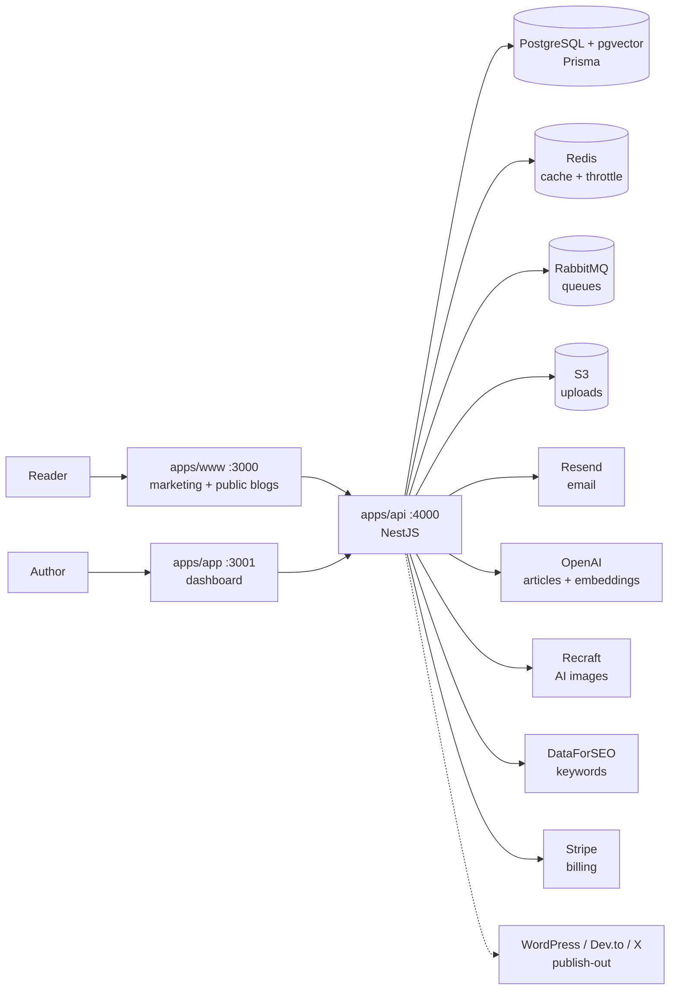

# Writora

An AI SEO content engine you can own. Writora researches keywords, generates SEO-ready articles (with images), publishes them on a schedule to your own hosted blog **and** out to WordPress, Dev.to, and X — then compounds the results with subscribers, newsletters, and a cross-site backlink network.

Each author gets a themable site at `yourdomain.com/username` (plus additional sites at `/s/site-slug`), custom domains, email subscribers, and a real authoring experience — without the bloat of WordPress or the rent-seeking of Medium. Self-host everything, or run it as a hosted product with Stripe billing built in.

> **Status:** active development. Local dev works end-to-end. Production deploys are possible but rough edges remain (see [Known limitations](#known-limitations)).

---

## What's in the box

**AI content engine**

- Full AI article generation (OpenAI): outline → sections → SEO metadata, delivered as a draft with progress tracking
- Keyword research via DataForSEO (search volume, difficulty, CPC), wired straight into generation
- On-page SEO scoring in the editor (local heuristics, no API cost)
- AI featured + inline images (Recraft), with per-site style settings
- Autopilot content plans: AI brainstorms an article cluster, then generates (and optionally publishes) on your cadence — with an interactive planner calendar
- In-editor AI assists: rewrite/expand selections, title suggestions, summaries

**Publishing & growth**

- Publish out to WordPress (via the bundled Writora Connector plugin), Dev.to, and X auto-posts — manual "Publish to…" or automatic on publish
- Multi-site workspaces: separate blogs, subscribers, categories, and destinations per site
- Cross-site backlink network: consenting member sites exchange semantically-matched backlinks (pgvector embeddings), gated by each site's declared niche
- Related-posts on the public site via the same embeddings

**For authors**

- Rich-text editor (Tiptap) with images, code blocks, embeds — drag/drop & paste images upload to object storage
- 40+ swappable themes per site (powered by [tweakcn](https://tweakcn.com))
- Autosave + unsaved-changes guard, scheduled publishing, draft previews
- Auto read-time, SEO metadata, JSON-LD article schema, dynamic OG images
- Analytics dashboard (views over time, top posts, week-over-week trend)
- Subscribers with double opt-in + **email newsletter blast on every publish** (durable via RabbitMQ)
- In-app notification inbox for background work (article ready, cross-post failed, plan completed, …)

**For readers**

- Per-author public site at `/{username}` (secondary sites at `/s/{slug}`) with hero + grid + bio
- Per-post pages with TOC, related posts, view tracking (deduped per IP)
- RSS feeds with auto-discovery, sitemap, subscribe widget on every page

**Billing & ops**

- Stripe subscriptions (Free / Pro / Business) via raw REST — Checkout, Customer Portal, HMAC-verified webhooks, idempotency ledger
- Entitlements enforced server-side (sites, AI articles/month, destinations, custom domains, autopilot, backlink network, keyword research)
- Redis caching + per-IP rate limiting, RabbitMQ durable queues, S3-compatible storage, sharp image pipeline
- Crash-recovery sweeps: stuck generation jobs are reaped (and quota refunded), wedged autopilot plans un-wedge themselves
- Graceful degradation: Redis/Rabbit/S3/OpenAI/Stripe/DataForSEO unset → features 503 or fall back; the free blogging core works with none of them

---

## Architecture



Three apps share a single API. Auth is JWT in an httpOnly cookie shared across the `.yourdomain.com` subdomain.

---

## Quick start (Docker)

```bash
# 1. Spin up the full stack (the api applies migrations on startup)
JWT_SECRET=$(openssl rand -hex 32) docker compose up -d --build

# 2. Open
open http://localhost:3000   # marketing + public blogs (www)
open http://localhost:3001   # dashboard (app)
```

The compose file includes Postgres (with pgvector), Redis, RabbitMQ, and the three apps. RabbitMQ management UI is at <http://localhost:15672> (`guest`/`guest`).

To enable the paid-feature stack locally, export the relevant keys before `docker compose up` (or put them in a `.env` at the repo root — compose interpolates them): `OPENAI_API_KEY`, `RECRAFT_API_KEY`, `DATAFORSEO_LOGIN`/`DATAFORSEO_PASSWORD`, `ENCRYPTION_KEY`, `STRIPE_*`. See `apps/api/.env.example` for the full list — everything is optional except `JWT_SECRET`.

---

## Local dev (without Docker)

You'll need: Node 22, pnpm 10, Postgres **with the pgvector extension**, optionally Redis + RabbitMQ.

```bash
# Install
pnpm install

# Set up env for each app
cp apps/api/.env.example apps/api/.env
cp apps/app/.env.example apps/app/.env
cp apps/www/.env.example apps/www/.env
# Fill in DATABASE_URL, JWT_SECRET (same value in all 3), RESEND_API_KEY if you want emails

# Apply migrations
pnpm --filter api exec prisma migrate deploy

# Run everything in parallel
pnpm dev
```

`pnpm dev` runs all three apps via turbo. You can also run them individually:

```bash
pnpm --filter api dev    # http://localhost:4000
pnpm --filter app dev    # http://localhost:3001
pnpm --filter www dev    # http://localhost:3000
```

If you skip Redis/RabbitMQ/S3, the api degrades gracefully: cache becomes a no-op, newsletter blasts run inline, and uploads land on local disk. Email sends are logged to stdout when `RESEND_API_KEY` is unset. AI, keyword research, image generation, CMS publish-out, and billing each return 503 until their keys are configured.

---

## Project structure

```
.
├── apps/
│   ├── api/          NestJS — REST API
│   │   ├── prisma/   Schema + migrations (pgvector for embeddings)
│   │   └── src/
│   │       ├── auth/          JWT + Google OAuth + email verification + password reset
│   │       ├── blog/          Blog CRUD + sanitization + scheduler + newsletter trigger
│   │       ├── ai/            Article generation pipeline + AI images + assists + job reaper
│   │       ├── keyword/       DataForSEO keyword research + saved keywords
│   │       ├── seo/           On-page SEO scoring (local)
│   │       ├── content-plan/  Autopilot plans + cadence scheduler + planner feed
│   │       ├── publish/       CMS publish-out (WordPress / Dev.to / X adapters)
│   │       ├── backlink/      Cross-site backlink engine (pgvector matching)
│   │       ├── embedding/     OpenAI embeddings for posts + niches
│   │       ├── network/       Backlink-network membership
│   │       ├── site/          Multi-site workspaces + site context
│   │       ├── billing/       Stripe (checkout, portal, webhook, idempotency)
│   │       ├── entitlements/  Plan limits + atomic usage metering
│   │       ├── notifications/ In-app notification inbox
│   │       ├── analytics/     Views, dashboard stats, per-blog stats
│   │       ├── subscriber/    Double opt-in subscriber management
│   │       ├── webhook/       Outbound webhooks + inbound blog intake
│   │       ├── internal/      External cron trigger (sleep-prone hosts)
│   │       ├── email/         Resend client + react.email templates
│   │       ├── cache/         Redis client + read-through cache + throttler storage
│   │       ├── queue/         RabbitMQ producer/consumer (+ inline fallback, DLQ)
│   │       ├── crypto/        AES-256-GCM for CMS credentials at rest
│   │       ├── storage/       Pluggable: local disk or S3-compatible
│   │       └── upload/        Image upload endpoint (sharp processing)
│   ├── app/          Next.js dashboard — write, generate, plan, publish, analyze
│   └── www/          Next.js marketing site + public blogs, sitemap, RSS
├── packages/
│   ├── ui/           Shared React components
│   ├── eslint-config/
│   └── typescript-config/
└── plugins/
    └── writora-connector/   WordPress plugin receiving publish-out (zipped by CI)
```

---

## Tech stack

| Concern          | Choice                                        |
| ---------------- | --------------------------------------------- |
| Runtime          | Node 22                                       |
| Package manager  | pnpm 10 (workspaces)                          |
| Monorepo         | Turborepo                                     |
| API              | NestJS 11                                     |
| Web              | Next.js 16 (App Router)                       |
| Database         | PostgreSQL + pgvector via Prisma 7            |
| AI text          | OpenAI (articles, assists, embeddings)        |
| AI images        | Recraft                                       |
| Keyword data     | DataForSEO                                    |
| Billing          | Stripe (raw REST, HMAC-verified webhooks)     |
| Cache / throttle | Redis (ioredis)                               |
| Queue            | RabbitMQ (amqplib)                            |
| Object storage   | S3-compatible (`@aws-sdk/client-s3`)          |
| Email            | Resend + react.email templates                |
| Editor           | Tiptap + lowlight syntax highlighting         |
| Themes           | tweakcn registry (40+ themes)                 |
| Image pipeline   | sharp (resize + WebP)                         |
| Auth             | JWT (httpOnly cookie) + bcrypt + Google OAuth |
| Sanitization     | sanitize-html                                 |

---

## Common commands

```bash
# Quality gates (all run in CI on every push/PR)
pnpm check               # format:check + lint + check-types
pnpm test                # unit tests (api Jest suite)
pnpm format              # apply Prettier formatting
pnpm lint:fix            # auto-fix what's fixable
pnpm build               # build everything

# Database
pnpm --filter api exec prisma migrate dev     # create + apply a new migration
pnpm --filter api exec prisma migrate deploy  # apply existing migrations (prod-safe)
pnpm --filter api exec prisma studio          # GUI at localhost:5555
```

Each script also exists per-workspace (`pnpm --filter api lint`, etc.).

---

## Environment variables

See `.env.example` in each app. **`JWT_SECRET` must be identical** across `apps/api`, `apps/app`, and `apps/www` — the Next middleware verifies the cookie the API issues.

| Category         | Required for               | Vars                                                                                                                                  |
| ---------------- | -------------------------- | ------------------------------------------------------------------------------------------------------------------------------------- |
| Database         | always                     | `DATABASE_URL` (Postgres with pgvector)                                                                                               |
| Auth             | always                     | `JWT_SECRET` (in all three apps)                                                                                                      |
| Public URLs      | always                     | `NEXT_PUBLIC_API_URL`, `NEXT_PUBLIC_WWW_URL`, `NEXT_PUBLIC_APP_URL`, `SITE_URL`, `APP_URL`, `PUBLIC_API_URL`                          |
| AI articles      | AI generation/assists      | `OPENAI_API_KEY` (+ `OPENAI_MODEL`)                                                                                                   |
| AI images        | featured/inline images     | `RECRAFT_API_KEY` (+ `RECRAFT_MODEL`, `RECRAFT_API_URL`)                                                                              |
| Keyword research | keyword tools              | `DATAFORSEO_LOGIN`, `DATAFORSEO_PASSWORD` (+ `DATAFORSEO_LOCATION_CODE`, `DATAFORSEO_LANGUAGE_CODE`)                                  |
| Billing          | paid plans                 | `STRIPE_SECRET_KEY`, `STRIPE_WEBHOOK_SECRET`, `STRIPE_PRICE_PRO`, `STRIPE_PRICE_BUSINESS`                                             |
| Publish-out      | CMS credential storage     | `ENCRYPTION_KEY` (32-byte hex/base64)                                                                                                 |
| Google OAuth     | "Sign in with Google"      | `GOOGLE_AUTH_CLIENT_ID`, `GOOGLE_AUTH_SECRET_ID`, `GOOGLE_REDIRECT_URL`                                                               |
| Email            | verification/newsletters   | `RESEND_API_KEY`, `EMAIL_FROM`, `EMAIL_REPLY_TO` (www contact form also uses `CONTACT_TO_EMAIL`)                                      |
| Cache + throttle | recommended in prod        | `REDIS_URL`                                                                                                                           |
| Queue            | recommended in prod        | `RABBITMQ_URL`                                                                                                                        |
| Object storage   | uploads off local disk     | `S3_BUCKET`, `S3_REGION`, `S3_ENDPOINT`, `S3_ACCESS_KEY_ID`, `S3_SECRET_ACCESS_KEY`, `S3_PUBLIC_URL`, `S3_FORCE_PATH_STYLE`, `S3_ACL` |
| External cron    | sleep-prone hosts (Render) | `CRON_SECRET` — external scheduler POSTs `/internal/cron/tick`                                                                        |

Everything except the first two categories is optional: unset features return 503 (or degrade) instead of breaking the core.

---

## Deployment

The included Dockerfiles (`apps/{api,app,www}/Dockerfile`) produce slim production images using multi-stage builds and Next.js standalone output. A `render.yaml` blueprint deploys the API to Render (designed for Neon Postgres with pgvector + an external cron pinger).

```bash
# Build all images
docker compose build
```

**Recommended hosts:**

- **API**: Railway, Render, Fly.io, or any VM/container service with a persistent process. Avoid serverless — the newsletter/generation consumers need to stay running. (On hosts that sleep, set `CRON_SECRET` and point an external cron at `POST /internal/cron/tick` — it wakes the dyno and runs due work.)
- **www + app**: Vercel works, or any host that runs the standalone Next.js output.
- **Postgres**: Neon or Supabase — **must support pgvector** (both do; `CREATE EXTENSION vector` runs in migrations).
- **Redis**: Upstash (free tier sufficient for small traffic).
- **RabbitMQ**: CloudAMQP (free tier).
- **Object storage**: Cloudflare R2 (no egress fees, generous free tier) is the most cost-effective.

**Important runtime notes:**

- `NEXT_PUBLIC_*` variables are baked in at **build time**, not runtime. Pass them as `--build-arg` during `docker build`.
- Set `COOKIE_DOMAIN` to your apex with a leading dot (e.g. `.yourdomain.com`) so the auth cookie is shared across api/app/www subdomains. Leave empty for localhost dev.
- Set `CORS_ORIGINS` to a comma-separated allowlist of origins (e.g. `https://yourdomain.com,https://app.yourdomain.com`). Defaults to localhost only.
- Set `APP_URL` to your dashboard URL — Google OAuth callbacks and Stripe checkout return there.
- The WordPress connector (`plugins/writora-connector/`) is zipped by CI as a build artifact; install it on the target WordPress site and paste its token into Destinations.

---

## Known limitations

These are real and on the roadmap:

- **No e2e tests.** The API has ~185 unit tests (auth, blog cache, entitlements, billing, publish adapters, schedulers, reapers), but controller-level e2e flows and the two Next apps are uncovered.
- **No error tracking.** Sentry or similar is unconfigured.
- **The WordPress plugin round-trip is verified against mocks**, not a live WordPress install, in this repo's test setup.
- **DataForSEO requires a verified account** before its billable endpoints return data — credentials alone aren't enough.
- **Email/Discord/Telegram notification channels** are intentionally not implemented; notifications are in-app only for now.

---

## License

UNLICENSED — all packages are private. This will likely change once a license decision is made.
